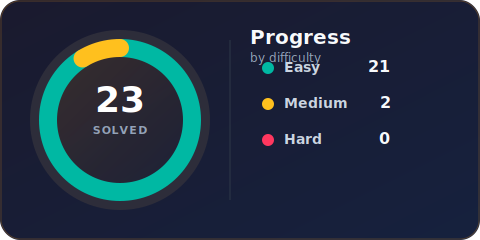

<div align="center">

# 🧠 LeetCode Solutions

*Personal problem-solving journal — organized by difficulty*



[](https://leetcode.com)
[](src/Easy)
[](src/Medium)
[](src/Hard)

</div>

---

## 📊 Summary

| Difficulty | Solved | Share |
|:-----------|-------:|------:|
| 🟢 Easy | **28** | 77% |
| 🟡 Medium | **8** | 22% |
| 🔴 Hard | **0** | 0% |
| **Total** | **36** | 100% |

## 📁 Solutions

> Solutions live under `src/Easy`, `src/Medium`, and `src/Hard`.

<details open>
<summary><b>🟢 Easy</b> — 28 problem(s)</summary>

| # | Problem | Solution |
|--:|:--------|:--------:|
| 35 | [Search Insert Position](https://leetcode.com/problems/search-insert-position/) | [📄 View](<src/Easy/[35]Search Insert Position.java>) |
| 58 | [Length of Last Word](https://leetcode.com/problems/length-of-last-word/) | [📄 View](<src/Easy/[58]Length of Last Word.java>) |
| 66 | [Plus One](https://leetcode.com/problems/plus-one/) | [📄 View](<src/Easy/[66]Plus One.java>) |
| 69 | [Sqrt(x)](https://leetcode.com/problems/sqrtx/) | [📄 View](<src/Easy/[69]Sqrt(x).java>) |
| 70 | [Climbing Stairs](https://leetcode.com/problems/climbing-stairs/) | [📄 View](<src/Easy/[70]Climbing Stairs.java>) |
| 83 | [Remove Duplicates from Sorted List](https://leetcode.com/problems/remove-duplicates-from-sorted-list/) | [📄 View](<src/Easy/[83]Remove Duplicates from Sorted List.java>) |
| 88 | [Merge Sorted Array](https://leetcode.com/problems/merge-sorted-array/) | [📄 View](<src/Easy/[88]Merge Sorted Array.java>) |
| 94 | [Binary Tree Inorder Traversal](https://leetcode.com/problems/binary-tree-inorder-traversal/) | [📄 View](<src/Easy/[94]Binary Tree Inorder Traversal.java>) |
| 100 | [Same Tree](https://leetcode.com/problems/same-tree/) | [📄 View](<src/Easy/[100]Same Tree.java>) |
| 101 | [Symmetric Tree](https://leetcode.com/problems/symmetric-tree/) | [📄 View](<src/Easy/[101]Symmetric Tree.java>) |
| 104 | [Maximum Depth of Binary Tree](https://leetcode.com/problems/maximum-depth-of-binary-tree/) | [📄 View](<src/Easy/[104]Maximum Depth of Binary Tree.java>) |
| 108 | [Convert Sorted Array to Binary Search Tree](https://leetcode.com/problems/convert-sorted-array-to-binary-search-tree/) | [📄 View](<src/Easy/[108]Convert Sorted Array to Binary Search Tree.java>) |
| 110 | [Balanced Binary Tree](https://leetcode.com/problems/balanced-binary-tree/) | [📄 View](<src/Easy/[110]Balanced Binary Tree.java>) |
| 111 | [Minimum Depth of Binary Tree](https://leetcode.com/problems/minimum-depth-of-binary-tree/) | [📄 View](<src/Easy/[111]Minimum Depth of Binary Tree.java>) |
| 112 | [Path Sum](https://leetcode.com/problems/path-sum/) | [📄 View](<src/Easy/[112]Path Sum.java>) |
| 118 | [Pascal's Triangle](https://leetcode.com/problems/pascals-triangle/) | [📄 View](<src/Easy/[118]Pascal's Triangle.java>) |
| 136 | [Single Number](https://leetcode.com/problems/single-number/) | [📄 View](<src/Easy/[136]Single Number.java>) |
| 144 | [Binary Tree Preorder Traversal](https://leetcode.com/problems/binary-tree-preorder-traversal/) | [📄 View](<src/Easy/[144]Binary Tree Preorder Traversal.java>) |
| 145 | [Binary Tree Postorder Traversal](https://leetcode.com/problems/binary-tree-postorder-traversal/) | [📄 View](<src/Easy/[145]Binary Tree Postorder Traversal.java>) |
| 169 | [Majority Element](https://leetcode.com/problems/majority-element/) | [📄 View](<src/Easy/[169]Majority Element.java>) |
| 217 | [Contains Duplicate](https://leetcode.com/problems/contains-duplicate/) | [📄 View](<src/Easy/[217]Contains Duplicate.java>) |
| 242 | [Valid Anagram](https://leetcode.com/problems/valid-anagram/) | [📄 View](<src/Easy/[242]Valid Anagram.java>) |
| 257 | [Binary Tree Paths](https://leetcode.com/problems/binary-tree-paths/) | [📄 View](<src/Easy/[257]Binary Tree Paths.java>) |
| 258 | [Add Digits](https://leetcode.com/problems/add-digits/) | [📄 View](<src/Easy/[258]Add Digits.java>) |
| 345 | [Reverse Vowels of a String](https://leetcode.com/problems/reverse-vowels-of-a-string/) | [📄 View](<src/Easy/[345]Reverse Vowels of a String.java>) |
| 605 | [Can Place Flowers](https://leetcode.com/problems/can-place-flowers/) | [📄 View](<src/Easy/[605]Can Place Flowers.java>) |
| 1071 | [Greatest Common Divisor of Strings](https://leetcode.com/problems/greatest-common-divisor-of-strings/) | [📄 View](<src/Easy/[1071]Greatest Common Divisor of Strings.java>) |
| 1431 | [Kids With the Greatest Number of Candies](https://leetcode.com/problems/kids-with-the-greatest-number-of-candies/) | [📄 View](<src/Easy/[1431]Kids With the Greatest Number of Candies.java>) |

</details>

<details open>
<summary><b>🟡 Medium</b> — 8 problem(s)</summary>

| # | Problem | Solution |
|--:|:--------|:--------:|
| 7 | [Reverse Integer](https://leetcode.com/problems/reverse-integer/) | [📄 View](<src/Medium/[7]Reverse Integer.java>) |
| 19 | [Remove Nth Node From End of List](https://leetcode.com/problems/remove-nth-node-from-end-of-list/) | [📄 View](<src/Medium/[19]Remove Nth Node From End of List.java>) |
| 24 | [Swap Nodes in Pairs](https://leetcode.com/problems/swap-nodes-in-pairs/) | [📄 View](<src/Medium/[24]Swap Nodes in Pairs.java>) |
| 29 | [Divide Two Integers](https://leetcode.com/problems/divide-two-integers/) | [📄 View](<src/Medium/[29]Divide Two Integers.java>) |
| 49 | [Group Anagrams](https://leetcode.com/problems/group-anagrams/) | [📄 View](<src/Medium/[49]Group Anagrams.java>) |
| 98 | [Validate Binary Search Tree](https://leetcode.com/problems/validate-binary-search-tree/) | [📄 View](<src/Medium/[98]Validate Binary Search Tree.java>) |
| 109 | [Convert Sorted List to Binary Search Tree](https://leetcode.com/problems/convert-sorted-list-to-binary-search-tree/) | [📄 View](<src/Medium/[109]Convert Sorted List to Binary Search Tree.java>) |
| 151 | [Reverse Words in a String](https://leetcode.com/problems/reverse-words-in-a-string/) | [📄 View](<src/Medium/[151]Reverse Words in a String.java>) |

</details>

<details>
<summary><b>🔴 Hard</b> — 0 problem(s)</summary>

| # | Problem | Solution |
|--:|:--------|:--------:|
| — | *No solutions yet* | — |

</details>

---

## ⚙️ Workflow

| Step | Action |
|:-----|:-------|
| 1 | Open a problem in the **LeetCode VS Code** extension and click `Code Now` |
| 2 | Solution file is saved to `src/{difficulty}/[id]Problem Name.java` |
| 3 | Refresh docs: `bash update-readme.sh` |
| 4 | Commit & push: `bash push.sh` |

```bash
# Quick refresh
bash update-readme.sh

# Refresh + commit + push
bash push.sh
```
